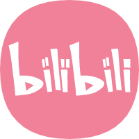

# Gesture-Pi
<p align="center">
  <a href="https://github.com/gesture-Pi/Gesture-recognition-sysytem">
    
  </a>
<br />
 <p align="center">
    A remotely finger guessing game based on Raspberry Pi. 
    <br />
</div>
<p align="center">
  <a href="https://www.bilibili.com/video/BV1sA411V7Yw/">
    
  </a>
  <a href="https://twitter.com/Caiwentao12345">
    
  </a>
  <a href="https://www.youtube.com/watch?v=zLDupBEazR8">
    
  </a>
  


## Table of Contents
- [Introduction]( #Introduction)
- [Algorithm](#Algorithm)
- [Hardware](#Hardware)
- [Prerequisites](#Prerequisites)
- [Contributing](#contributing)
- [License](#license)
- [Contact](#Contact)


## Introduction

Gestrue Pi uses capacitor boards as a sensor to recognize the voltage and current changes when users make different gestures, and then transmits the data to raspberry pi, which is used for gesture recognition and communication with other devices.
When we can achieve this, it will be able to do many things. For example, two people can play with Rock-Paper-Scissors remotely and enjoy an immersive experience through raspberry pi.

## Algorithm

KNN (K-Nearest Neighbor) method, originally proposed by Cover and Hart in 1968, is a relatively mature method in theory and one of the simplest machine learning algorithms.The idea of this method is very simple and intuitive: if most of the K most similar (that is, the closest in the feature space) samples of a sample belong to a certain category, then the sample also belongs to this category.In the classification decision, the method only determines the category of the samples to be divided according to the category of the nearest one or several samples.

## Hardware

[FDC2214 sensor](document/FDC2214)
<br />
[STM32Fxx](https://uk.rs-online.com/web/p/microcontrollers/0402279/?gclid=EAIaIQobChMIpM_4j7mK8AIVTLTtCh0UZAAxEAAYASAAEgLis_D_BwE&gclsrc=aw.ds)(we use STM32F103C8T6here)
<br />
[an OLED screen](https://item.taobao.com/item.htm?id=565268851518&ali_refid=a3_430673_1006:1151926661:N:WFoiFXIH007ZiutAq%2B3BZQ%3D%3D:1932cfb731eaea0fd428272e019ed1c0&ali_trackid=1_1932cfb731eaea0fd428272e019ed1c0&spm=a2e0b.20350158.31919782.6)
<br />
[rocker botton or replaced by several bottons](https://detail.tmall.com/item.htm?id=620908458252&ali_refid=a3_430673_1006:1123793357:N:6OPPrB0+uX2elEPTt8Nlog==:b6f869ff14e6c9779e455577b3e83b6a&ali_trackid=1_b6f869ff14e6c9779e455577b3e83b6a&spm=a2e0b.20350158.31919782.2)
<br />
[Raspberry Pi 4 B](https://www.amazon.co.uk/gp/product/B07WKKS471/ref=ppx_yo_dt_b_asin_title_o01_s00?ie=UTF8&psc=1)
<br />
<p align="center">
  <a href="https://github.com/gesture-Pi/Gesture-recognition-sysytem">
    
  </a>

## Prerequisites

This project consists of two parts: the STM32 and the raspberry pi program. The former uses Keil4 or 5 to run, which requires basic librabry, and it can be found in [libraries file](modules/Gesture-STM32/Libraries/Keil.STM32F1xx_DFP.2.0.0.pack).  

While the raspberry pi would need to fix the serial port in ttyAMA0 which would be relatively stable than the other.

This project uses pthread. Go check if you don't have them locally installed.

```sh
$ sudo apt-get install pthread
```

Besides, the chip should be connected in the right way of raspberry pi:
```sh
GND - pin6, RXD - pin8, TXD - pin10.
```

## Usage


ALL the file have been integrated in Makefile, you can just make and then run in the raspberrypi.

```sh
$ make
$ ./Pisever
```
after running successfully, user can choose two types of mode:1.Digit Recognition 2.Rock-Paper-Scissors Game
<br />
```sh
Which mode do you want? 1 Finger or 2 Fist
```
After choosing one
<br />
```sh
Do you want to use the existing dataset? 0 not or 1 yes
......
```
at first use, user can only choose 0 to train new dataset. user should adjust gesture with tips until program tells that train finished. then user can coutinue to test data.

<br />
```sh

## Contributing

[Buchen Ping](https://github.com/PBC1998)
<br />
[Kaitong Qu](https://github.com/qukaitong)
<br />
[Wentao Cai](https://github.com/caiwentao123)

## License
[MIT License](LICENSE)

## Contact
Buchen Ping 2539945P@student.gla.ac.uk
<br />
Wentao Cai 2582656C@student.gla.ac.uk
<br />
Kaitong Qu 2289284Q@student.gla.ac.uk
